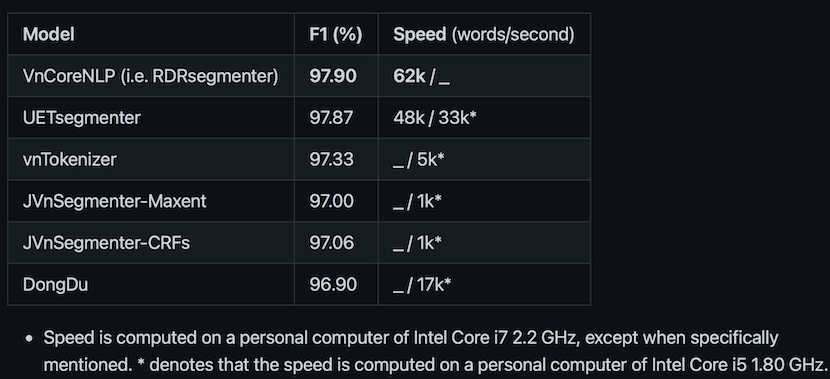

# stage-1 (90% done `docs/*1-viet_token.md`)

# stage-2 (triển khai `docs/*2-syllabling.md`)

## Module 2b/ `syllables2words`: gộp âm tiết thành từ

- - -

# STAGE-01: Nửa năm nhìn lại (06/2021-12/2021)

[ GOAL ] PHÁT HIỆN, TRÌNH BÀY LẠI VÀ INDEX TOKENS SAO CHO CÓ THỂ XEM+XÉT CORPUS THẬT NHANH, LOẠI BỎ DỮ LIỆU TRÙNG LẶP, PHÁT HIỆN CÁC TRƯỜNG HỢP BẤT THUÒNG, TỰ ĐỘNG SỬA LỖI, BỎ ĐI NHỮNG ĐOẠN TEXT KÉM CHẤT LƯỢNG

Dưới góc nhìn quản trị dữ liệu còn rất nhiều việc thú vị để làm như là phát hiện và loại bỏ trùng lặp, indexing để tìm kiếm và so sánh nhanh các câu trong corpus, phát hiện sự thiếu, thừa, sai / không hoàn chỉnh ... của dữ liệu.

Nếu coi corpus là một file text lớn, mỗi câu được chứa trên một dòng, mỗi dòng khoảng 12.5 tokens, thì 10 triệu dòng chiếm khoảng 600MB. Mỗi file text lớn có file index (.idx) riêng đi kèm, tương tự như có file thông tin trích xuất như định danh / mã hoá (.cdx) riêng đi kèm.

Dùng `u32` để định danh thì sẽ chứa được gần 4.3 tỉ đầu mục, tương đương với 1 file text copus 2.1Tb. Dữ liệu https://pile.eleuther.ai cho mô hình ngôn ngữ siêu khủng mới chỉ ở mức 0.8Tb (800GB).


## Thành tựu chính

* Dùng âm vị học để phân tích và định danh nhanh mọi âm tiết TV viết thường thành `15-bits` mà không cần dùng dữ liệu đối chiếu (lookup-table, trie, ...) để chuyển từ dạng text thành định danh cũng như từ định danh 16-bits khôi phục lại dạng text của âm tiết. (xem `src/syllable_data_struct.zig`). 

Số lượng âm tiết tiếng Việt viết thường lọc từ corpus rơi vào khoảng 12k. [HieuThi](http://www.hieuthi.com/blog/2017/03/21/all-vietnamese-syllables.html) chỉ ra TV có khoảng 18k âm tiết, chứng tỏ khoảng 6k (33%) âm tiết có thể đúng về mặt ghép âm nhưng không được hoặc rất ít khi được sử dụng. 18k âm tiết thì phải dùng `15-bits` để định danh, không thể ít hơn. Nếu dùng `16-bits` (2-bytes) để định danh tokens thì dùng `15-bits cao` để lưu từ điển TV `32_768` và phần còn lại của `15-bits thấp` để chứa OOV `6_516`. Nếu cần nhiều slots hơn cho OOV thì gạn xem syllable_ids nào invalid (ko đúng luật ngữ âm) sẽ đc thêm `8_370`.

* Thống kê và liệt kê token types theo freqs và length, phân chia thành token trong bảng chữ cái có dấu + thanh `alphamark`, token trong bảng chữ cái không dấu thanh `alpha0m0t`, token không thuộc bảng chữ cái `nonalpha`, nhờ đó phát hiện nhanh token bất thường, token lỗi ... (xem https://github.com/telexyz/results#readme)

* Thử nghiệm với gần 1Gb text trộn từ Facebook comments, news titles, viet opensub, wikipedia, sách, truyện .. Trong vòng 45 giây phân tách được: 
```r
 73% tokens âm tiết tiếng Việt  148_280_481  "của và có không là được cho các"
  6% tokens thuộc bảng chữ cái   11_953_258  "đ đc NĐ ĐH TP USD inbox shop"
 21% tokens ngoài bảng chữ cái   43_576_527  ". , - : ? ; '' " 1 ! 2 / ... 2020 🤣 19000019"
(18% ngoài bảng chữ cái 1 ký tự  37_108_988) ". , - : ? ; ' 1 2 /"
- - - - - - - - - - - - - - - - - - - - - -
100% tổng tokens                203_810_266
```
=> TRUNG BÌNH MỘT GIÂY PHÂN TÁCH VÀ PHÂN LOẠI 5 TRIỆU TOKENS, ĐỊNH DANH 3.65 TRIỆU ÂM TIẾT TV
Trên máy macbook 2015, 8Gb ram, 1.1Ghz Duo-core Intel M

_Đối chiếu_

1/ https://github.com/phuonglh/vn.vitk | https://github.com/phuonglh/jlp can tokenize a text of two million Vietnamese syllables in 20 seconds on a cluster of three computers (24 cores, 24 GB RAM), giving an accuracy of about 97%

2/ https://github.com/vncorenlp/VnCoreNLP
{width=720 height=320}


- - -

[ BY PRODUCT 1 ] Thống kê từ vựng và n-gram cơ bản, sửa lỗi chính tả đơn giản dựa trên phân tích âm vị học ...

[ BY PRODUCT 2 ] Cải tiến bộ gõ Telex, dùng `az,ez,oz` thay `aa,ee,oo` để thống nhất với cách bỏ dấu như `aw,ow,uw`; chỉ bỏ dấu và thanh cuối âm tiết `nuoc|ws`

__Câu hỏi đặt ra:__

Yếu điểm có thể coi là lớn nhất của Telex là viết song ngữ rất chậm,
vì hay bị hiểu lầm thành dấu mũ. Việc chuyển bàn phím thì cũng rất mất thời gian !!!
Làm thế nào để giảm thiểu sự nhầm lẫn khi gõ tiếng Anh lẫn lộn với tiếng Việt ???
Viết hoàn toàn không dấu và để máy tự bỏ dấu với sự trợ giúp từ người dùng ???