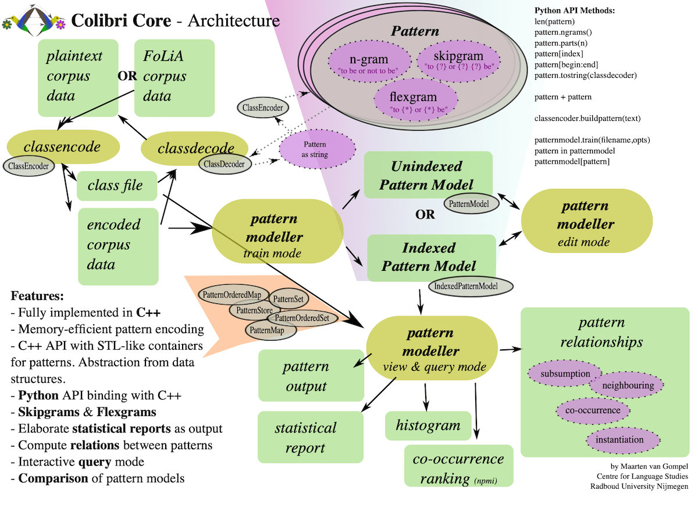

# KEYWORDS

N-Gram, SkipGram, LexGram, UniGram ...
Unique Count
Smoothing, Interpolation
Goodman, Kneser-Ney, Stupid-backoff
Bloom filter, Hash, Cache

!!! LƯU Ý KHI DỮ LIỆU ĐẦU VÀO LỚN SẼ LÀM MỜ DẦN SỰ KHÁC BIỆT CỦA CÁC KỸ THUẬT !!!

- - -

## Rất nhiều thông tin về n-gram LM `docs/+language_models` download từ
http://demo.clab.cs.cmu.edu/11711fa18

### Efficient n-gram, Skipgram and Flexgram Modelling with Colibri Core
https://openresearchsoftware.metajnl.com/articles/10.5334/jors.105
https://proycon.github.io/colibri-core/doc

* `n-gram` – n consecutive words

* `skipgram` – An abstract pattern of predetermined length with one or multiple gaps (of specific size).

A fixed-length sequence of p word tokens and q token placeholders/wildcards with total length n (n = p + q), the placeholders constitute gaps or skips and a `skipgram` can contain multiple of these. In turn, a gap can span one or more tokens. For example: “to _ or _ _ be”

* `flexgram` – An abstract pattern without predetermined length, with one or more gaps.

Some may use the term `skipgram` to include what we call `flexgram`, or use another term such as `elastigram` to refer to flexgrams.

Skipgrams are used in the field to obtain a higher level of generalisation than can be offered by n-grams. They can, for instance, be found as features in classification tasks [1], or AS A MEANS IN LANGUAGE MODELLING TO DECREASE PERPLEXITY [3,10].

- -

`colibri-ngrams` - Extracts n-grams of a particular size from the corpus text, in the order they occur, i.e. by moving a sliding window over the text.

`colibri-freqlist` - Extracts all n-grams from one or more corpus text files and
outputs a frequency list. Also allows for the extraction of skipgrams. By default all n-grams are extracted, but an occurrence threshold can be set with the -t flag.

`colibri-ngramstats` - Prints a summary report on the ngrams in one or
more corpus text files. To get the full details on interpreting the output report, read the section Statistical Reports and Histograms.

`colibri-histogram` - Prints a histogram of ngram/skipgram occurrence count

`colibri-queryngrams` - Interactive tool allowing you to query ngrams from standard input, various statistics and relations can be output.

`colibri-reverseindex` - Computes and prints a reverse index for the specified corpus text file. For each token position in the corpus, it will output what patterns are found there (i.e start at that very same position)

`colibri-loglikelihood` - Computes the log-likelihood between patterns in two or more corpus text files, which allows users to determine what words or patterns are significantly more frequent in one corpus than the other.

`colibri-coverage` - Computes overlap between a training corpus and a test corpus, produces coverage metrics.

`colibri-findpatterns` - Finds patterns (including skipgrams and flexgrams) in corpus data. You specify the patterns in a text file (one per line).

- -

* _Compressed binary representation_ -- Each word type is assigned a numeric class, which is encoded in a compact binary format in which HIGHLY FREQUENT CLASSES TAKE LESS SPACE than less frequent classes. Colibri core always uses this representation rather than a full string representation, both on disk and in memory.

* _Informed iterative counting_ -- Counting is performed more intelligently by iteratively processing the corpus in several passes and quickly DISCARDING PATTERNS THAT WON'T REACH THE DESIRED OCCURRENCE THRESHOLD.

Skipgram and flexgram extraction are computationally more demanding but have been implemented with similar optimisations. Skipgrams are computed by abstracting over n-grams, and flexgrams in turn are computed either by abstracting over skipgrams, or directly from n-grams on the basis of co-occurrence information (mutual pointwise information).

A pattern model is simply a collection of extracted patterns (any of the three categories) and their counts from a specific corpus. Pattern models come in two varieties:

* _Unindexed Pattern Model_ -- The simplest form, which simply stores the patterns and their count.

* _Indexed Pattern Model_ -- The more informed form, which retains all indices to the original corpus, at the cost of more memory/diskspace.
The Indexed Pattern Model is much more powerful, and allows more statistics and relations to be inferred.

The generation of pattern models is optionally parametrised by a minimum occurrence threshold, a maximum pattern length, and a lower-boundary on the different types that may instantiate a skipgram (i.e. possible fillings of the gaps).

- - -

## Smoothed Bloom filter language models: Tera-Scale LMs on the Cheap
https://aclanthology.org/D07-1049.pdf

We assign a small cache to the BF-LM models (between 1 and 2MBs depending on the order of the model) to store recently retrieved statistics and derived probabilities. Translation takes between **2 to 5 times longer** using the BF-LMs as compared to the corresponding SRILM models.

## Randomized Language Models via Perfect Hash Functions
https://aclanthology.org/P08-1058.pdf

Our randomized LM is based on the Bloomier filter (Chazelle et al., 2004). We assume the n-grams and their associated parameter values have been precomputed and stored on disk. We then encode the model in an array such that each n-gram’s value can be retrieved. Storage for this array is the model’s only significant space requirement once constructed.

The model uses randomization to map n-grams to fingerprints and to generate a perfect hash function that associates n-grams with their values. The model can erroneously return a value for an n-gram that was never actually stored, but will always return the correct value for an n-gram that is in the model.

The proposed randomized LM can encode parameters estimated using any smoothing scheme (e.g. Kneser-Ney, Katz etc.). Here we choose to work with stupid backoff smoothing (Brants et al., 2007) since this is significantly more efficient to train and deploy in a distributed framework than a context-dependent smoothing scheme such as Kneser-Ney. Previous work (Brants et al., 2007) has shown it to be appropriate to large-scale language modeling.

## KenLM: Faster and Smaller Language Model Queries
https://kheafield.com/papers/avenue/kenlm.pdf
https://kheafield.com/papers/avenue/kenlm_talk.pdf
https://kheafield.com/papers/edinburgh/estimate_paper.pdf
https://kheafield.com/papers/edinburgh/estimate_talk.pdf

Maximize speed and accuracy subject to memory. 
Probing > Trie > Chop > RandLM Stupid for both speed and memory.

## Faster and Smaller N-Gram Language Models
http://nlp.cs.berkeley.edu/pubs/Pauls-Klein_2011_LM_paper.pdf
Slower and larger than KenLM https://github.com/adampauls/berkeleylm

N-gram language models are a major resource bottleneck in machine translation. We present several language model impl that are both highly compact and fast to query. Our fastest impl is as fast as the widely used SRILM while requiring only 25% of the storage. 

Our most compact representation can store all 4 billion n-grams and associated counts for the Google n-gram corpus in 23 bits per n-gram, the most compact lossless representation to date, and even more compact than recent lossy compression techniques. We also discuss techniques for improving query speed during decoding, including a simple but novel LANGUAGE MODEL CACHING technique that improves the query speed of our language models (and SRILM) by up to 300%.

Overall, we are able to store the 4 billion n-grams of the Google Web1T corpus, with associated counts, in 10 GB of memory, which is smaller than state-of-the-art lossy language model implementations (Guthrie and Hepple, 2010). 

## A Bayesian Interpretation of Interpolated Kneser-Ney
https://www.stats.ox.ac.uk/~teh/research/compling/hpylm.pdf
https://www.gatsby.ucl.ac.uk/~ywteh/research/compling/acl2006.pdf

Interpolated Kneser-Ney is one of the best smoothing methods for n-gram language models. Previous explanations for its superiority have been based on intuitive and empirical justifications of specific properties of the method. We propose a novel interpretation of interpolated Kneser-Ney as approximate inference in a hierarchical Bayesian model consisting of Pitman-Yor processes. As opposed to past explanations, our interpretation can recover exactly the formulation of interpolated Kneser-Ney, and performs better than interpolated Kneser-Ney when a better inference procedure is used.

- - -

https://www.edwardraff.com/publications/hash-grams-faster.pdf

The results are presented in Table 1, where we see that the exact n-gram and hash-gram models have indistinguishable accuracy on both of the test sets. All scores are close, and fluctuated between slightly better and worse on individual numbers. The slight changes in results are not unexpected due to the hash collisions, but is clearly of equivalent predictive quality to the exact n-gram model.

The Hash-Gram approach was 68.8 times faster in extracting the top-k features compared to the n-gram approach, allowing us to reduce a two week job on a cluster down to under three days on a single node. We note that the code used for the exact n-gram is highly optimized Java code that has gone through three years of performance tuning and improvements to scale up the n-gram processing.

## Recursive Hashing Functions for n-Grams
https://www.csee.umbc.edu/courses/graduate/676/recursivehashingp291-cohen

## Efficient Indexing of Repeated n-Grams
https://ciir-publications.cs.umass.edu/getpdf.php?id=939

n-gram http://web.stanford.edu/~jurafsky/slp3

https://medium.com/mti-technology/n-gram-language-models-b125b9b62e58