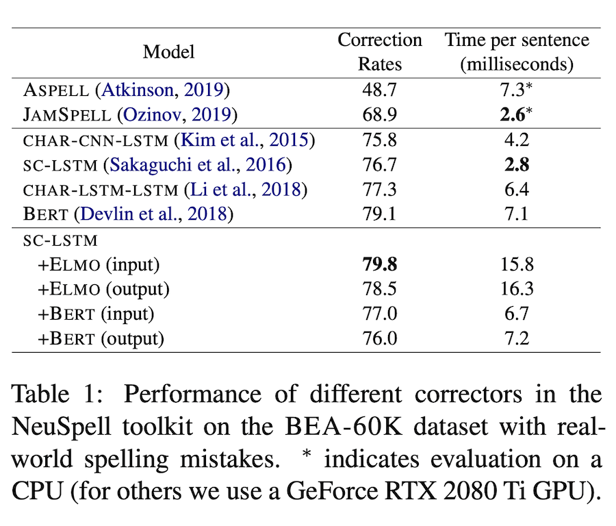
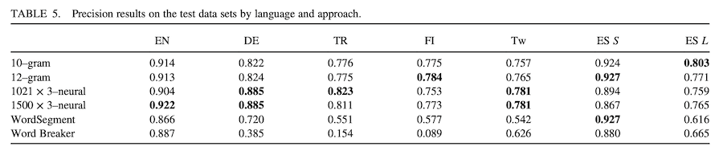

JamSpell mới dùng 3-gram đã đạt được độ chính xác tầm 69%
Các kiểu LSTM đều đạt ngưỡng tầm 79%

[2] cho thấy +10-gram tăng hiệu quả lên tương đương với NN

=> Thử tăng n-gram với JamSpell xem có tăng độ chính xác lên nhiều không?

{width=500 height=410}

