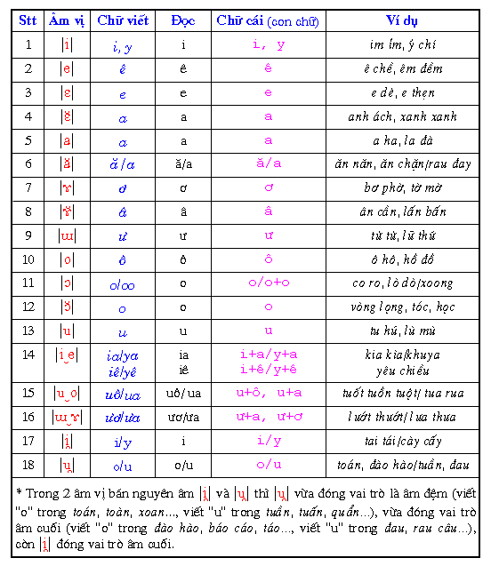

## `syllable_data_structs.zig`

### Compact `am_cuoi + tone` to `6-bits`

`62 = 13*6 - 4*4` // 4 âm cuối `c,ch,p,t` ko dùng 4 thanh `_none,f,r,x`
=> 62 slots to store `am_cuoi + tone` combinations (__lucky :D__)

### Final results

Total: 16-bits

    // 25 đầu           5-bits
    // 23 giữa          5-bits
    // 62 cuối + tone   6-bits

Tổng số slots `65_536 = 2^16`
Số slots dùng `35_650 = 25*23*62`
Số slots dư   `29_886` dư chứa OOV (dùng BPE)

Như vậy chỉ cần `16-bits` là đủ để chứa `vocab` tiếng Việt viết thường (lowercase) + OOV

- - -

### Thử rút gọn `âm_cuối`

    i,      ai        oái
    y,  -   ay   ây   oáy   uây

    u,      au
    o,  -   ao   eo   oao   oeo

                            HOÀNG OANH HOẰNG
    ng,     ang  ăng        oang  oăng
    nh, -?  anh  ênh  inh   oanh         uênh  uynh

    c,      ac   êc         oác
    ch, -?  ach  êch  ich   oách  uệch  uỵch

Thay thế:

y/

     a  y =>  aw i
     az y =>  az i
    oa  y => oaw i
    uaz y => uaz i

o/

     a o => aw u
     e o =>  e u
    oa o => oa u
    oe o => oe u

nh?

     ez nh =>  ez ng
     i  nh =>  i  ng
    uez nh => uez ng
    uy  nh => uy  ng
     anh? !=> aw ng
    oanh? !=> oă ng
    oách? !=> oắ c

ch?

    ếch? !=> ếc

=> âm cuối bỏ được `y,o`, còn 11 âm cuối (âm cuối + tone <= `50 = 11*6 - 4*4`)

=> Vẫn cần 16-bits nhưng dư nhiều slots hơn

    // 25 đầu           5-bits
    // 23 giữa          5-bits
    // 50 cuối + tone   6-bits

Tổng số slots `65_536 = 2^16`
Số slots dùng `28_750 = 25*23*50`
Số slots dư   `36_786` thoải mái chứa OOV (dùng BPE)

## REFs

[1/ Liệt kê cách đánh vần tiếng Việt đầy đủ các âm vị](https://sites.google.com/site/sachquocngu/chuong-5/bai-75)

[2/ Phiên âm vị tiếng Việt](https://vnlp.net/tiếng-việt-cơ-bản/hệ-thống-am-vị)
