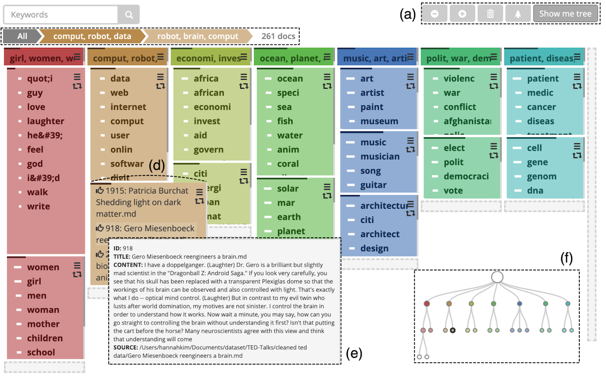
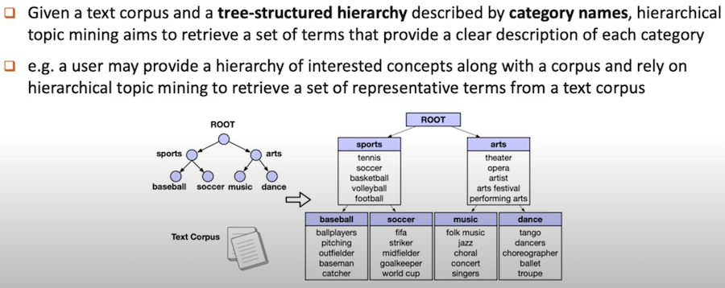
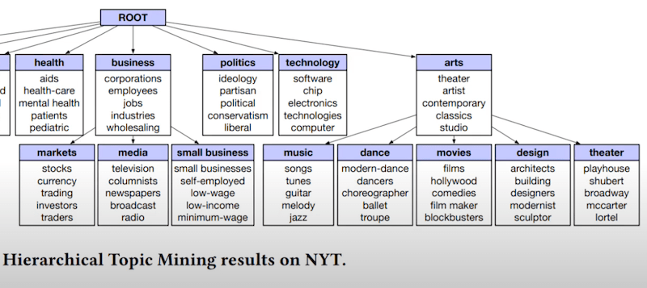

## ArchiText: Interactive Hierarchical Topic Modeling

https://faculty.cc.gatech.edu/~aendert3/resources/Kim2020ArchiText.pdf

{width=800 height=500}

https://faculty.cc.gatech.edu/~aendert3/resources/Kim2020ArchiText.pdf

## module 4a/ Tìm topics cho từng đoạn của 150 bài pháp

### INPUT:
  - Khoảng 7500 đoạn văn bản ngắn
  - Init categories dưới dạng cây mà người dùng quan tâm

### OUPUT:
  - Phát hiện thêm các topics (representative terms) để làm rõ hơn nội dung của các init categories

### REPEAT: 
  - Dựa vào kết quả trên, điều chỉnh init categories và lại bắt đầu lại để đạt được cây categories người dùng thấy ưng.

_NOTE_: Phần này ko cần `n-gram`, không cần `syllables2words`
mà cần `dict_matching`, `word2vec` ... Cụ thể như sau:

* Nhóm âm tiết thành từ (dict matching)
* Loại bỏ stopwords (dùng stopword dict)
* Nhúng các cụm từ (1 câu có thể có nhiều matching) vào không gian vectors
* Căn chỉnh vị trí vectors sao cho có độ tương đồng về khoảng cách với các terms trong cây categories
* Clustering để tìm ra thêm các topics (representative terms)

## Libs

https://opensourcelibs.com/libs/topic-modeling

## Hierarchical Topic Mining via Joint Spherical Tree and Text Embedding
  https://github.com/yumeng5/JoSH
  https://yumeng5.github.io/files/JoSH.pdf
  https://arxiv.org/pdf/2007.09536.pdf

### Xem video https://www.youtube.com/watch?v=AIvtHkPiIpo

{width=800 height=320}

