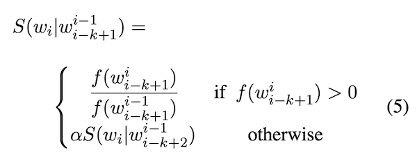

# Stupid Backoff
https://aclanthology.org/D07-1090.pdf

_Note: alpha = 0.4_

Stupid Backoff is inexpensive to calculate in a distributed environment while APPROACHING THE QUALITY OF KNESER-NEY SMOOTHING FOR LARGE AMOUNTS OF DATA.

https://stackoverflow.com/questions/16383194/stupid-backoff-implementation-clarification
So in the above example if we are not able to find a tri-gram or bi-gram the final score would be: 0.4 * 0.4 * frequency(day) / corpus_size? // YES!

## Absolute Discount

d1 = 0.5, d2+ = 0.75
_Note: P(W) cuối công thức là P(Wi); Với c(..) == 0 => 0 + interpolated prob_

# ENHANCEMENTS 

## Towards Competitive N-gram Smoothing
http://proceedings.mlr.press/v108/falahatgar20a/falahatgar20a.pdf
