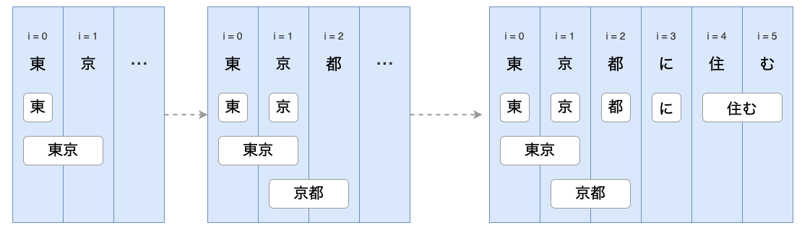
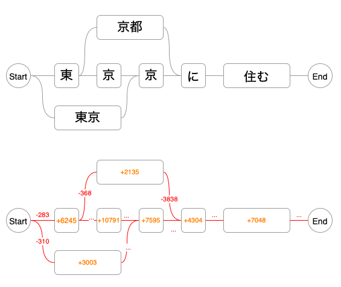

# Tách từ tiếng Nhật dựa trên từ điển và lưới tìm kiếm
https://towardsdatascience.com/how-japanese-tokenizers-work-87ab6b256984

Hầu hết bộ tách từ tiếng Nhật dựa trên lưới tìm kiếm (dùng Viterbi để tìm ra lựa chọn tốt nhất), nổi tiếng nhất là MeCab. Hầu hết mọi bộ tách từ mã mở tiếng Nhật thường là đóng gói lại MeCab hoặc viết lại thuật toán tìm kiếm lưới:

* Kotori in Kotlin
* Sudachi and Kuromoji in Java
* Janome and SudachiPy in Python
* Kagome in Go.

Từ điển MeCab’s IPA (IPADIC) là từ điển phổ biến nhất, nó được dùng như là nền tảng cho các bộ tách từ. Ví dụ:
```c
東京,1293,1293,3003,名詞,固有名詞,地域,一般,*,*,東京,トウキョウ,トーキョー
京都,1293,1293,2135,名詞,固有名詞,地域,一般,*,*,京都,キョウト,キョート
札幌,1293,1293,3440,名詞,固有名詞,地域,一般,*,*,札幌,サッポロ,サッポロ
渋谷,1293,1293,4310,名詞,固有名詞,地域,一般,*,*,渋谷,シブヤ,シブヤ
```
Thông tin ở 4 cột đầu tiên là quan trọng nhất:
* Từ ở dạng con chữ (text form of the word).
* Định danh ngữ cảnh trái/phải: để đánh giá khả năng xuất hiện cùng nhau của 2 từ.
* Khả năng xuất hiện của từ đó: càng là từ hiếm, cái giá để từ đó xuất hiện càng cao.
Các cột khác bổ xung thêm thông tin như từ loại, dạng chuẩn hoá, cách phát âm ...

## CHI PHÍ KẾT NỐI (CONNECTION COST)

Là một cấu trúc để đo lường khả năng xuất hiện cùng nhau của hai từ. Khả năng xuất hiện cùng nhau được đo bằng chi phí để kết nối định danh ngữ cảnh phải của từ trước với định danh ngữ cảnh trái cửa từ sau. Trong MeCab chi phí này được định nghĩa trong file `matrix.def`:
```
1316 1316
0 0 -434
0 1 1
0 2 -1630
0 3 -1671
...
1315 1313 -4369
1315 1314 -1712
1315 1315 -129
```

## XỬ LÝ TỪ CHƯA BIẾT (OOV): Dùng luật phỏng đoán

## TÁCH TỪ DỰA TRÊN LƯỚI TÌM KIẾM
```js
val lattice = Lattice.create()
for i in 0..text.length {
    val terms = findAllTermStartingAt(text, i)
    for term in terms {
        lattice.add(term, startIndex=i, endIndex=i+term.length)
    }
    ...
}
...
return lattice.findTheBestPath()
```



Mỗi đỉnh và mỗi kết nối của lưới đều có một trọng số định giá chi phí (được định nghĩa sẵn trong từ điển). Chi phí càng nhỏ khả năng được lựa chọn của đỉnh và khả năng được lựa chọn của kết nối càng cao.

Kết quả cuối cùng quy về bài toán tìm kiếm đường đi cho chi phí tối thiểu.

## THUẬT TOÁN VITERBI
```js
for i in 0..text.length {
  for node in nodes.startingAt(i) {
    for prevNode in nodes.endingAt(i) {
      
      val prevTotalCost = prevNode.totalCost
      val termCost = node.cost
      val connectionCost = getConnectionCost(prevNode.rightId, node.leftId)
      val totalCost = prevTotalCost + connectionCost + termCost
      
      if (totalCost < node.totalCost) {         
        node.totalCost = totalCost
        node.prevNode = prevNode
      }

    }
  }
}
```

# [Kiến trúc bộ tách từ Jumanpp](files/jumanpp_design.pdf)

## 1/ Giới thiệu

Với các ngôn ngữ không dùng dấu cách (space) như tiếng Nhật, Trung ... bước đầu tiên cần làm là phân tách text thành từ. Việc phân tách thường được làm cùng với gán nhãn từ loại (POS tagging), toàn bộ quá trình trên được gọi là PHÂN TÍCH HÌNH THÁI HỌC (Morphological Analysis).

Bộ phân tích hình thái học tiếng Nhật đạt độ chính xác rất cao, F1 score > .99 trong lĩnh vực đặc thù như tin tức chẳng hạn. Khi được áp dụng sang lĩnh vực khác độ chính xác giảm xuống, sẽ rất khó để tăng độ chính xác nếu không dùng chuyên gia gán nhãn dữ liệu và để máy học. 

Năm 2015, mô hình ngôn ngữ dựa trên mạng neuron hồi quy (RNNLM) được dùng kết hợp với mô hình tuyến tính kết hợp nhiều đặc trưng (feature-rich linear model) để tăng độ chính xác phân tích hình thái; đây là tiền đề của Jumanpp. Mô hình kết hợp trên cân nhắc được sự hợp lý về mặt ngữ nghĩa của việc tách từ và vì thế làm giảm đi đáng kể các lỗi tách từ không chấp nhận được; đạt được độ chính xác cao nhất trên dữ liệu của Jumandic (bộ từ điển tiêu chuẩn tách từ 2012). Tiếc rằng tốc độ quá chậm là hạn chế tính ứng dụng của Jumanpp đời đầu.

Năm 2018, Jumanpp được viết lại tăng 250x tốc độ và độ chính xác cũng được cải thiện. Jumanpp sử dụng thiết kế phân tích hình thái học dựa trên từ điển. Trong quá trình phân tích các ứng cử viên sẽ được lựa chọn từ từ điển và bộ xử lý từ lạ (unknown word handler). 

Viết lại Jumanpp là để tăng tốc độ nhưng đồng thời cũng cần đủ mềm dẻo và mạnh mẽ. So với MeCab (2004) trình bày không gian tìm dưới dạng bảng (ma trận 2 chiều; có tính toán trước và sử dụng partial lexicalization bi-gram?), sau khi truy cập bảng sẽ cộng thêm unigram score kết hợp (tổng cộng 2 thao tác: truy cập bảng và cộng unigram score). Jumanpp đánh giá 60 đặc trưng cho mỗi đỉnh của lưới tìm kiếm của giải thuật tìm kiếm chùm (beam search) và chỉ chậm hơn MeCab 5 lần. Chúng tôi cho rằng việc thực hiện số lượng tính toán lớn sao cho hiệu quả là quan trọng để phát triển các công cụ xử lý ngôn ngữ tự nhiên.

## 2/ Tổng quan về phân tích hình thái học

Tiếng Nhật không dùng dấu cách (space), vậy nên cần phải tách văn bản (gộp ký tự) thành các từ. Có 2 hướng tiếp cận cơ bản là supervised và un-supervised. Supervised dùng dữ liệu được gán nhãn bởi con người. Un-supervised sử dụng thuật toán để quyết định, thường dựa trên lý thuyết thông tin. Ở đây ta tập trung vào supervised.


### 2.1/ Hình vị và phân tích hình thái học

Nhìn chung, hình vị và phân tích hình thái học tiếng Nhật có sự khác biệt với tiếng Âu - Mỹ, định nghĩa thế nào là từ cũng lỏng lẻo hơn (word is ill-defined). Từ giờ trở đi hình vị và từ được dùng thay thế lẫn nhau như là một đơn vị của quá trình phân tách.

Tiếng Nhật có nhiều tiêu chuẩn hình thái học khác nhau như IPADic, Jumandic, UnniDic. Hầu hết mọi bộ phân tích tiếng Nhật đều dùng từ điển phân tách để định nghĩa cách tách từ của từng corpus một. Mục tiêu của từ điển phân tách là làm sao cho _MỘT CÂU CHỈ CÓ MỘT CÁCH PHÂN TÁCH DUY NHẤT_. Bộ từ điển như thế cần được cùng duy trì với một corpus được gán nhãn. Tiếng Trung không dùng từ điển phân tách. Từ điển được tạo nên bằng cách tập hợp tất cả các từ độc nhất có trong corpus. Tuy thế, hầu hết bộ phân tách đều sử dụng nhiều trích chọn đặc trưng và các tài nguyên bổ xung được huấn luyện từ trước như n-gram ký tự, word embeddings, và làm tăng kích thước của mô hình.

Có hai hướng đi chính trong phân tách supervised là: _POINTWISE VÀ SEARCH-BASED_. Pointwise ra quyết định cho điểm giao của mỗi cặp ký tự dựa vào các thông tin chung quanh giao điểm đó (do tiếng Nhật không dùng dấu cách còn với tiếng Việt là điểm giao của mỗi cặp âm tiết); việc ra quyết định là độc lập ở mỗi điểm. Search-based tìm kiếm một giải pháp tối ưu (tối đa hoá một hàm mục tiêu / hàm tính điểm)

...

### Độ chính xác giảm khi đơn vị so sánh là câu

Mặc dù đạt độ chính xác hơn 99% ở mức độ từ trong một lĩnh vực cụ thể như tin tức, độ chính xác giảm xuống đáng kể khi đơn vị so sanh là cả câu. Với KU corpus là 93% (127 lỗi / 1,783 câu), với KUDLC là 88% (265/2,195). Với dữ liệu như bình luận của người dùng trên mạng xã hội thì độ chính xác còn giảm đi nhiều nữa (more noise, diff domain).

Tolmachev et al. (2019) huấn luyện bộ phân tích hình thái học bằng mạng neuron pointwise dựa trên bộ corpus đã được phân tích hình thái học bằng các công cụ truyền thống. Cách tiếp cận này đạt kết quả bằng và đôi lúc hơn bộ phân phân tích truyền thống dùng để khởi tạo dữ liệu. Hơn nữa dung lượng của mô hình nhỏ hơn rất nhiều và trong nhiều trường hợp cho kết quả dễ hiểu hơn. Điểm yếu của cách tiếp cận này là khi bổ xung từ mới phải phân tích lại corpus và huấn luyện lại mô hình từ đầu.

Xem thêm [Rút gọn kích thước mô hình bộ tách từ tiếng Nhật với mạng neuron và máy học bán giám sát](https://aclanthology.org/N19-1281.pdf)

## Jumanpp Internals

1/ Linear score computation (kết hợp 60 features)
2/ beam search (n-best)
3/ RNN model (re-ranking n-best) (optional)

1/ phức tạp bao gồm: cấu trúc từ điển, feature computation hashing, prefectching, struct-of-arrays layout for lattice.

## Kết luận

...

# REFs

[Old-school Japanese Morphological Analysis](https://shijieyao.github.io/files/TNLP.pdf)
JUMAN, ChaSen, MeCab, KyTea


NEWERs

https://github.com/lindera-morphology/lindera

https://github.com/ikawaha/kagome

https://github.com/wanasit/kotori

https://github.com/ku-nlp/jumanpp | [slides](files/jumanpp_slides.pdf)

A dictionary independent thread-safe library for morphological analysis using LATTICE-BASED SEGMENTATION optimized for n-best output. It does not depend on Jumandic or Japanese Language (albeit there are some Japanese-specific functionality). See [this tutorial project](https://github.com/eiennohito/jumanpp-t9) which shows how to implement a something similar to a T9 text input for the case when there are no word boundaries in the input text.
