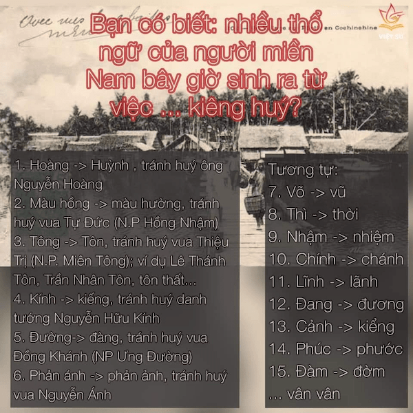

## ĐẠI CHIẾN D - GI BAO GIỜ MỚI KẾT THÚC?
https://www.facebook.com/cachvietdung/posts/1560211234128917

### i/y

Về i/y thì bộ giáo dục đã thống nhất tất cả các trường hợp trừ tên người hoặc địa danh, là đơn nguyên âm thì sử dụng chữ [i] và chỉ giữ lại [y] trong một số tổ hợp âm như ay, ây, yê+, uy+. Các từ điển, sách giáo khoa đã tuân theo quy tắc này rất tốt nhưng các phái đối lập vẫn muốn giữ quan điểm của họ và nhất định không theo.

Về d/gi thì vẫn chưa có sự vào cuộc của các cơ quan chức năng có thẩm quyền và các cuộc chiến tranh giữa d/gi vẫn cứ diễn ra hằng ngày trong cuộc sống của người dân.

### ĐỀ XUẤT LỰA CHỌN CÁCH VIẾT GIỮA 2 PHỤ ÂM D VÀ GI
https://www.facebook.com/cachvietdung/posts/1373459462804096

Các học giả đã thống kê được đến hơn 50 từ có thể viết âm đầu là “d” hoặc “gi” đều được. Một số (cặp) từ tiêu biểu thuộc loại này như: dàn/giàn (mướp), (cái) dại/giại, (trôi) dạt/giạt, (đánh) dậm/giậm, dẫm/giẫm (đạp), (bờ) dậu/giậu, dở/ giở (chứng), (cơn) dông/giông, dội/giội (nước), (mài) dũa/giũa, (thư) dãn/giãn, (già) dặn/giặn, dong/giong (buồm)...

Trong trường hợp dở/giở thì "dở" là một từ diễn tả trạng thái chưa hoàn thành. Như dở dang, dở hơi, nấu dở nồi cơm,...

Còn giở là hành động lật lên, nâng lên. Như giở nắp ấm, giở trang sách,...
Giở vốn là một âm nằm trong hệ thống biến đổi gi/tr như giời/trời, giăng/trăng, giữ/trữ, giương/trương (buồm), nhà gianh (tranh), giao/trao (phó), giầu/trầu (cau), giồng/trồng (cây), ...

Trường hợp dậu/giậu thì ta thấy gi hoàn toàn áp đảo chứ không hề giống hiện tượng dâu da/giâu gia. Riêng trường hợp này, rất có thể lại nằm trong hiện tượng gi/tr. Theo đó giâu vốn bị biến đổi từ loài cây họ trẩu. Và cũng có thể người ta liên tưởng tới loài dâu tằm nên gọi là dâu da mặc dù chúng không tương đồng nhiều về loại thực vật.

Các trường hợp lưỡng khả khác, ta hoàn toàn có thể tạo ra một quy tắc tránh gây nhầm lẫn bằng cách: _Âm `d` sẽ biểu thị động từ, và `gi` sẽ biểu thị cho danh từ hoặc tính từ_

* dàn quân / giàn mướp
* dạt ra (tách ra 他動詞) / (tính từ / 自動詞) trôi giạt
* dậm chân / cái giậm
* dẫm đạp / chết (tính từ) giẫm 
* dông dài? / cơn giông
* dội nước / _
* mài dũa / cái giũa
* dãn hàng / thư (tính từ) giãn
* căn dặn / già (tính từ) giặn (có thể là từ láy gi)
* dong buồm / miến giong?
* dóng (uốn nắn, chỉnh đốn) / (đơn vị từ) gióng mía
* _ / (đơn vị từ) giòng sông ???

https://www.facebook.com/yeutiengvietta




https://vi.wikipedia.org/wiki/Chữ_Quốc_ngữ

Chữ Quốc ngữ là tên gọi cho bộ chữ Latinh phổ thông được dùng để viết tiếng Việt hiện nay[3]. Chữ Quốc ngữ được tạo ra bởi các tu sĩ Dòng Tên Bồ Đào Nha và Ý, bằng việc cải tiến bảng chữ cái Latinh và ghép âm dựa theo quy tắc chính tả của văn tự tiếng Bồ Đào Nha[1] và một chút tiếng Ý[4].

Muộn nhất là từ năm __1867__ đã có người gọi chữ Latinh cho tiếng Việt là chữ quốc ngữ.[5] Trong năm này, Trương Vĩnh Ký xuất bản hai quyển sách về ngữ pháp. Quyển đầu là sách tiếng An Nam viết bằng chữ quốc ngữ về ngữ pháp tiếng Pha Lang Sa (tiếng Pháp) có tên gọi là Mẹo luật dạy học tiếng pha-lang-sa. Trong sách có tên gọi chữ quốc ngự (ngự chứ không phải là ngữ) được dùng để chỉ văn tự Latinh tiếng Việt.

Chữ quốc ngữ có 11 chữ ghép biểu thị phụ âm gồm:

10 chữ ghép đôi: ch, gh, gi, kh, ng, nh, ph, qu, th, tr
1 chữ ghép ba: ngh

Bảng chữ cái tiếng Việt trong Từ điển có ít chữ cái hơn bảng chữ cái tiếng Việt đương đại. Các ký hiệu ă, â, ê, ô, ơ, ư, được xem là chữ cái trong bảng chữ cái tiếng Việt đương đại, đều đã có trong Từ điển nhưng tác giả của Từ điển không xem chúng là chữ cái độc lập. Trong Từ điển, mọi ký hiệu được cấu thành từ một tự mẫu nguyên âm và một hoặc hai dấu phụ, thí dụ như à, ạ, ă, ằ, ặ, đều không được xem là một tự mẫu riêng biệt khác với tự mẫu nguyên âm xuất hiện trong ký hiệu đó,à, ạ, ă, ằ, ặ đều chỉ được xem là tự mẫu a mang dấu phụ chứ không được xem là những tự mẫu khác với tự mẫu a.


- - -

## Âm vị tiếng Việt
http://vietsciences.free.fr/vietnam/tiengviet/tiengvietchico36amvi.htm

NOTE: Bài dài, hơi khó đọc nhưng hay ở chỗ nhìn được sự phát triển của tiếng nói Việt, có nguồn gốc, lai tạp, phát triển, ... khác giống nhau 2 miền bắc - nam, ảnh hưởng qua lại giữa hai miền. Trích dẫn dưới đây chỉ tập trung vào mặt học thuật là âm vị tiếng Việt.

Nếu ta theo đúng định nghĩa Tây phương về âm vị và phân tích theo các nhà ngôn ngữ Tây phương về nguyên âm thì tiếng Việt có rất nhiều âm vị. Xin liệt kê âm vị tiếng Việt phát âm miền Bắc như sau:

__THANH VÀ PHỤ ÂM__

6 thanh điệu: `không, sắc, huyền, hỏi, nặng, ngã`

20 phụ âm (ký hiệu phát âm được ghi trong hai gạch //, nhưng để giản dị, không ghi ký hiệu nếu phát âm trùng với chữ cái): 

B, /K/ (C và K), /Chz/ (CH và Tr miền Bắc), /d/ (Đ), /G/ (G và Gh), H, Kh, L, M, N, Ng (Ngh), Nh, P (Phụ âm đầu từ P là âm cổ nay dần dần phục hồi trở lại như pông sô, pia nô, pin), /Kw/ (Qu như quít), /F/ (Ph), T, Th, V, X, /Z/ (D, R, Gi miền Bắc).

Miền Nam có thêm 7 phụ âm Ch, Tr, R, S, J (như Jarai, jăm bông, ăn jơ), Y (Y, ghi âm quốc tế là /j/, là phụ âm đầu từ D nhẹ miền Nam và dùng cho các từ ngoại quốc như đồng Yen, ya ua, yo yo, yoga), W (Qu, oa, Hoa), nhưng không có âm Chz, Z, Kw, V.

Tổng số phụ âm của phát âm miền Nam là 20 - 4 + 7 = 23.
Tổng số phụ âm cho mọi phương ngữ là 20 + 7 = 27

Đến đây ta mới thấy sự khó khăn và tài tình của các nhà tiền phong khi sáng tạo chữ Quốc ngữ. Họ phải suy nghĩ nhiều cách để cả ba miền cùng xữ dụng một thứ chữ nhưng có thể đọc theo phát âm của mình, tương tự như Hán tự dùng cho mọi sắc dân Trung Quốc.

Ch và Tr ở miền Bắc hơi nặng phát âm thành chz, không có âm J nhưng có âm nặng hơn Gi. Vì thế các âm J đều bị thay thế bởi âm Gi như Jarai, Java, jăm bông, nạc jăm biến thành Gia Lai, Gia va, giăm bông, nạc giăm.

Gi không phải là một âm gồm hai âm vị G và I mà là một vị duy nhất /z/. Âm Gi có nguồn gốc xa xưa từ âm /ji/ tiếng Hán, ngày nay chỉ một số nhỏ đọc đúng Gi, còn đa số đọc là /z/ nên ta có thể cho nhập chung vào âm vị /z/.

Tương tự Qu không phải tạo thành bởi hai âm vị mà là một âm vị duy nhất /kw/, khác biệt với âm vị /k/ (phụ âm c). Quả cam không phải là /k/ủa cam -vì như thế sẽ đọc là của cam mà là /kw/ả cam. Tương tự quốc là /kw/ốc chớ không phải là /k/uốc vì như thế sẽ đọc là cuốc (xuổng). Sở dĩ các nhà tiền phong không dùng Kw mà dùng Qu để ba miền đều đọc được theo đúng phát âm của mình. Qu đọc là /kw/ như trong từ quit tiếng Anh. Tiếp theo là nói về nguyên âm.

__NGUYÊN ÂM__

11 nguyên âm đơn (monothong): `a, ă, â, e, ê, i (y), o, ô, ơ, u, ư`

28 nguyên âm kép (diphthong, nhị trùng âm) : `ai, ay, ây, ao, au, âu, eo, êu, ia, iu, iê, oa, oă, oe, oi , ôi, ơi, ua, uâ, uê, ui, uô, uy, ưa, ưi, ươ, ưu, ia`.

9 nguyên âm ba (triphthong, tam trùng âm): `iêu, oai, oay, uây, uôi, ươi, ươu, uya, uyê`
Tuy tên gọi là tam trùng âm nhưng nhiều khi chỉ là nhị trùng âm dài. Thí dụ như `uôi` là `uui`, `ươi` là `ư ư i`, `ươu` là `ư ư u` (ghi chú: đúng với cách phát âm miền Nam, ko đúng với miền Bắc).

Tổng số nguyên âm là 11 + 28 + 9 = 48
Miền Bắc có 6 thanh +20 phụ âm + 48 nguyên âm = 74 âm vị, bằng với số âm vị tiếng Thái.
Miền Nam có 5 thanh +23 phụ âm + 48 nguyên âm = 77 âm vị,
Tiếng Việt chung cho mọi phương ngữ có = 74 + 7 = 81 âm vị.

- - -

# Các bài viết thú vị khác ...

## Học tiếng Việt dễ hay khó?
https://www.kanji.org/jack/vietnamese/is_VN_hard_VN.pdf

- - -

## Tiếng Việt có mật độ thông tin cao nhất thế giới
https://www.facebook.com/groups/1928719334071361/permalink/2341504882792802

Ngôn ngữ khác nhau có mật độ thông tin và tốc độ khác nhau. trong mỗi ngôn ngữ nói, mật độ thông tin được chứa đựng trong mỗi âm tiết khác nhau, và nó có ảnh hưởng đến tốc độ của ngôn ngữ.

ví dụ 1: nếu bạn nghe người nhật nói tiếng nhật thì sẽ thấy họ nói chuyện rất nhanh. đó là vì mỗi âm tiết trong tiếng nhật có mật độ thông tin rất thấp, phải thêm nhiều âm tiết mới biểu hiện được một thông tin. thế nên họ phải nói nhanh để biểu hiện ra càng nhiều âm tiết, mới biểu hiện được càng nhiều thông tin.

ví dụ 2: trong tiếng anh, so sánh từ "dog" (chó) và từ "civilization" (văn minh). "dog" có 1 âm tiết, nhưng chứa đựng 1 thông tin. "civilization" có 5 âm tiết, nhưng khi phân chia ra từng âm tiết thì mỗi âm tiết đều không có nghĩa, phải đủ hết 5 âm tiết mới biểu hiện được 1 thông tin, thế nên phải nói nhanh hơn thay vì phát âm từ từ từng âm tiết.

theo nghiên cứu tốc độ ngôn ngữ thì tiếng tây ban nha là 7,82 âm tiết/giây, nhanh hơn tiếng anh là 6,19 âm tiết/giây, nhanh hơn tiếng quan (tiếng trung) là 5,18 âm tiết/giây. còn tiếng nhật thì nhanh hơn cả 3 ngôn ngữ, là 7,84 âm tiết/giây.

thế nhưng, khi nhìn vào mật độ thông tin thì là quan (0,94) > anh (0,91) > tây ban nha (0,63) > nhật (0,49). mật độ thông tin của tiếng quan cao hơn cả, và tiếng nhật thấp nhất.
vậy có thể thấy rằng, một ngôn ngữ càng nhiều mật độ thông tin trong mỗi âm tiết sẽ có tốc độ chậm hơn, và ngược lại.

nhưng có một điều rất thú vị là, những dữ liệu số này phải có 1 ngôn ngữ để làm tiêu chuẩn mới so sánh được, mới có dữ liệu được, PHẢI CHỌN 1 NGÔN NGỮ HỌ CHO LÀ CÓ MẬT ĐỘ THÔNG TIN CAO NHẤT THẾ GIỚI. VÀ HỌ CHỌN TIẾNG VIỆT.

vì sao? vì tiếng việt trong ngành nghiên cứu hiện giờ chính là ngôn ngữ có mật độ thông tin cao nhất thế giới, có tốc độ chậm nhất thế giới. đây là bởi vì tiếng việt có phụ âm, nguyên âm, thanh điệu phong phú nhất thế giới, một âm tiết có thể truyền tải nhiều thông tin nhất thế giới.

(và đây chỉ đang nói về ngôn ngữ nói thôi, chứ ngôn ngữ viết thì chưa có ai nghiên cứu, vì theo mình thấy thì một ngôn ngữ dùng phiên âm như tiếng việt không thể nào có mật độ thông tin cao hơn tiếng hán với hệ thống chữ viết biểu nghĩa như chữ hán được; đây chỉ là ý kiến riêng của mình, vì chưa có ai nghiên cứu thì không thể nào xác nhận được) tuy không có ngôn ngữ nào trên thế giới là ngôn ngữ thuần đơn âm (monosyllabic), tiếng việt vẫn là ngôn ngữ có nhiều đơn âm nhất thế giới.

mình lên mạng trung còn có nhiều người đã nghiên cứu qua vụ này nói rằng tiếng việt có mật độ thông tin cao hơn cả tiếng quảng, vốn cũng rất phong phú về âm. còn có người cho rằng mật độ thông tin của tiếng việt gần hoặc ngang hàng với văn ngôn (vốn là ngôn ngữ viết có mật độ thông tin cao nhất thế giới, ngày xưa trung nhật hàn việt đều dùng ngôn ngữ này để viết), hơn cả tất cả ngôn ngữ hán bây giờ, nhưng đây chỉ là cảm nghĩ của một số người, chưa có nghiên cứu để biết có đúng hay không.

thế nên, nếu tiếng việt còn duy trì dùng chữ hán nôm như xưa thì ngôn ngữ nói lẫn ngôn ngữ viết của việt nam sẽ là cao nhất thế giới, không ai sánh bằng.

thế nên tiếng việt mới có thể tạo những loại thơ thuận nghịch độc, vốn cần một ngôn ngữ có nhiều đơn âm. còn hay hơn nữa là tiếng việt làm được loại thơ này chỉ bằng một chữ viết biểu âm. trung quốc cũng có loại thơ này, vốn cần một chữ viết biểu nghĩa, mỗi chữ hán có 1 ý nghĩa thì thơ thuận nghịch độc mới đọc và hiểu được. nhưng nếu chữ viết tiếng trung hiện đại chỉ biểu âm như tiếng việt thì sẽ khó mà làm được thơ, vì âm tiết không đủ phong phú.

https://ocuaso.com/tho-viet-nam/chum-tho-bat-hu/2-bai-tho-thuan-nghich-doc-luc-chuyen-hoi-van-cua-han-mac-tu.html

```
1, Đi Thuyền (Hàn Mặc Tử – Lục Chuyển Hồi Văn)

Bèo trôi nước giợn sóng mênh mông
Cỏ mọc bờ xa bóng liễu trông
Chèo vững thiếp qua vời khổ hải
Chí bền chàng đến vận trung không
Theo lần nguyệt xế mây mờ mịt
Hoạ đáp thông reo trống não nồng
Neo thả biết đâu nơi định trước
Bèo trôi nước giợn sóng mênh mông

Đọc ngược:

Mông mênh sóng giợn nước trôi bèo
Trước định nơi đâu biết thả neo
Nồng não trống reo thông đáp họa
Mịt mờ mây xế nguyệt lần theo
Không trung vận đến chàng bền chí
Hải khổ vời qua thiếp vững chèo
Trông liễu bóng xa bờ cỏ mọc
Mông mênh sóng giợn nước trôi bèo

2, Cửa Sổ Đêm Khuya (Hàn Mặc Tử – Lục Chuyển Hồi Văn)

Hoa cười nguyệt rọi cửa lồng gương
Lạ cảnh buồn thêm nỗi vấn vương
Tha thướt liễu in hồ gợn sóng
Hững hờ mai thoảng gió đưa hương
Xa người nhớ cảnh tình lai láng
Vắng bạn ngâm thơ rượu bẽ bàng
Qua lại yến ngàn dâu ủ lá
Hoà đàn sẵn có dế bên tường.

Đọc ngược:

Tường bên dế có sẵn đàn hòa
Lá ủ dâu ngàn yến lại qua
Bàng bẽ rượu thơ ngâm bạn vắng
Láng lai tình cảnh nhớ người xa
Hương đưa gió thoảng mai hờ hững
Sóng gợn hồ in liễu thướt tha
Vương vấn nỗi thêm buồn cảnh lạ
Gương lồng cửa rọi nguyệt cười hoa

- - -

Vô Đề (Vua Tự Đức – Lục Chuyển Hồi Văn)

Gương tà nguyệt xế đã ngoài song
Héo hắt sao trông quá sức trông
Thương bấy thiết tha lòng héo liễu
Nhớ thêm vàng vọ má phai hồng
Vương sầu xiết tưởng chi ngôi bắc
Ðoạn thảm xui buồn vã chạnh đông
Chàng hỡi biết chăng ai bực bội
Loan hàng viết thảo tả tình chung

Đọc ngược:

Chung tình tả thảo viết hàng loan
Bội bực ai chẳng biết hỡi chàng
Đông chạnh vã buồn xui thảm đoạn
Bắc ngôi chi tưởng xiết sầu vương
Hồng phai má vọ vàng thêm nhớ
Liễu héo lòng tha thiết bấy thương
Trông sức quá trông sao héo hắt
Song ngoài đã xế nguyệt tà gương

Đền Ngọc Sơn (Khuyết Danh – Thuận Nghịch)

Linh uy tiếng nổi thật là đây:
Nước chắn, hoa rào, một khoá mây.
Xanh biếc nước soi, hồ lộn bóng,
Tím bầm rêu mọc, đá tròn xoay.
Canh tàn lúc đánh chuông ầm tiếng,
Khách vắng khi đưa xạ ngát bay.
Thành thị tiếng vang đồn cảnh thắng,
Rành rành nọ bút với nghiên này.

Đọc ngược:

Này nghiên với bút nọ rành rành:
Thắng cảnh đồn vang tiếng thị thành.
Bay ngát xạ đưa khi vắng khách;
Tiếng ầm chuông đánh lúc tàn canh.
Xoay tròn đá mọc rêu bầm tím;
Bóng lộn hồ soi nước biếc xanh.
Mây khoá một rào hoa chắn nước,
Đây là thật nổi tiếng uy linh.
```

- - -

## Tại sao người Nhật lại nói nhanh như vây ???
https://www.facebook.com/groups/CongdongVietNhat/permalink/1522880501061955/

Bạn đã từng gặp khó khăn vì tiếng nhật nói quá nhanh hoặc khi học tiếng nhật thì nghe được nhưng khi nghe tiếng nhật ngoài thực tế và trong công việc thì lại không hiểu hoặc thấy tiếng nhật mà người nhật dùng khác với tiếng nhật mình được học trong các sách dạy tiếng nhật ? Nếu có, chúng ta hãy cùng tìm hiểu nguyên nhân tại sao tiếng nhật lại khó nghe như vậy ?

Theo kết quả nghiên cứu "Quan sát tỉ lệ thông tin trên tốc độ nói của các ngôn ngữ khác nhau"của các học giả F.Pellegrino, C.Coupé và E.Marsico, đã tiến hành nghiên cứu và so sánh đặc điểm của 8 ngôn ngữ khác nhau trên thế giới trong đó có tiếng việt và tiếng nhật. Họ sử dụng một đoạn văn cố định và dịch sang 8 thứ tiếng, sau đó so sánh tốc độ phát âm, mật độ của từng ngôn ngữ (bao nhiêu âm tiết/giây) và lượng thông tin trung bình có trong một âm tiết đó là bao nhiêu.

Tiếng Việt được lấy làm mốc chuẩn để so sánh với các ngôn ngữ khác nên tiếng Việt sẽ mang tỷ lệ là 1/1 (chúng ta chủ yếu sẽ so sánh với tiếng nhật)Kết quả so sánh giữa tiếng việt và tiếng nhật thật bất ngờ:
Chúng ta sẽ cùng phân tích các số liệu trên để hiểu thêm tại sao tiếng nhật lại nói nhanh và khó nghe như vậy nhé !

- Mật độ thông tin: Nếu lấy tiếng Việt là 1 (mốc chuẩn) thì tiếng nhật là 0,49 => Tiếng nhật có mật độ thông tin bằng một nửa so với tiếng việt. Vì mật độ thông tin khi nói quá ít nên tiếng nhật phải nói nhanh hơn để bù lại.

- Số âm tiết phát ra trung bình trong một giây: với tiếng Việt là 5,22 trong khi tiếng nhật là 7,84 => Số lượng âm tiết phát ra trung bình trong một giây của tiếng nhật cao gấp 1,5 lần so với tiếng Việt. Vì số lượng âm tiết phát ra trong một giây khi nói tiếng nhật nhiều hơn tiếng việt nên các bạn sẽ cảm thấy tiếng nhật nói nhanh hơn tiếng việt rất nhiều.

- Tỷ lệ thông tin/âm tiết: Là số lượng thông tin chứa đựng trong một âm tiết, chúng ta sẽ lấy mật độ thông tin chia cho số âm tiết/giây. Nếu coi tiếng Việt có tỷ lệ hoàn hảo 1/1 (lấy tiếng việt làm mốc) thì tiếng Anh sẽ trên cả hoàn hảo (1,08/1), các thứ tiếng khác cũng xấp xỉ 1, chỉ có mỗi tiếng nhật là có tỉ lệ thấp nhất 0,74. Có nghĩa là tiếng nhật sẽ giao tiếp chậm hơn các ngôn ngữ khác. Và để truyền đạt một lượng thông tin bằng các ngôn ngữ khác trong cùng một khoảng thời gian thì tiếng nhật sẽ phải nói nhanh hơn => tốc độ nói tiếng nhật sẽ nhanh hơn các ngôn ngữ khác rất nhiều.
Kết quả nghiên cứu trên cho thấy, mặc dù là thứ tiếng nhanh nhất nhưng tiếng nhật lại không thể diễn đạt đầy đủ thông tin trong cùng một khoảng thời gian so với các thứ tiếng khác. Tại sao lại như vậy ???

Chúng ta hãy cùng phân tích những khía cạnh khác trong việc sử dụng tiếng nhật nhé !

- Các động từ tiếng nhật và tính từ tiếng nhật thường rất dài và cấu thành từ khoảng 2 đến 3 âm tiết trở lên (từ tiếng nhật thường là nhiều hơn 2 âm tiết). Với thể masu (thể lịch sự trong tiếng nhật) thì ít nhất một động từ cũng đã gồm 3 âm tiết rồi ví dụ: みます、かいます、のみます、あそびます、いただきます、もうしこみます. Như vậy là có những từ có đến 7 âm tiết, trong khi tiếng Việt hầu như không có động từ nào nhiều hơn 2 âm tiết ví dụ như: ăn, chơi, uống, ngủ ...

- Trong tiếng nhật hay dùng cách nói gián tiếp, sử dụng từ càng gián tiếp thì càng lịch sự. Giống như như từ いらっさいます là kính ngữ cho cả đi, đến, ở. Vì càng dài thì càng lịch sự nên các loại kính ngữ hay khiêm nhường ngữ (cách nói thể hiện sự khiêm nhường trong tiếng nhật) đều dài loằng ngoằng, rất khó nhớ và khó sử dụng.

- Một lý do rất quan trọng nữa là do số lượng âm tiết mà người nhật có thể phát âm được là rất ít. Số lượng âm tiết là tập hợp tất cả những âm tiết mà một thứ tiếng có thể biểu đạt được (có thể phát âm được). Theo kết quả nghiên cứu ở phía trên thì số lượng âm tiết của tiếng Anh là 7931 (cao nhất thế giới), xếp sau là tiếng Việt với khoảng 6200 âm tiết, tiếng Hoa có khoảng 1191 âm tiết trong khi tiếng nhật chỉ có vẻn vẹn 416 âm tiết. Do vậy trong tiếng nhật có rất nhiều từ đồng âm khác nghĩa, hơn nữa với số âm tiết ít như vậy thì tiếng nhật bắt buộc phải nói dài ra để đỡ việc nhầm lẫn. (đây là nguyên nhân tại sao người nước ngoài có thể phát âm được tiếng nhật nhưng người nhật sẽ rất khó khăn để phát âm tiếng Việt hay tiếng Anh cho chuẩn. Bạn nào nghe người nhật nói tiếng Anh rồi thì sẽ hiểu 

- Trong văn nói tiếng nhật xuất hiện rất nhiều những từ nói tắt, những từ tiếng nhật rất ngắn so với cách nói theo tiếng nhật chuẩn (ひょうじゅんご). Điều này cũng gây ra rất nhiều khó khăn cho những bạn chỉ được học tiếng nhật trong trường và chỉ học tiếng nhật chuẩn theo sách vì khi sử dụng trong thực tế các bạn sẽ không thể nghe và hiểu được vì từ tiếng nhật mà bạn được nghe không giống với từ tiếng nhật mà thầy cô đã giạy khi chúng ta học tiếng nhật trong nhà trường mặc dù nó là cùng một từ, hay mang cùng một ý nghĩa. 
Chúc các bạn luôn giữ được ngọn lửa đam mê với tiếng nhật!