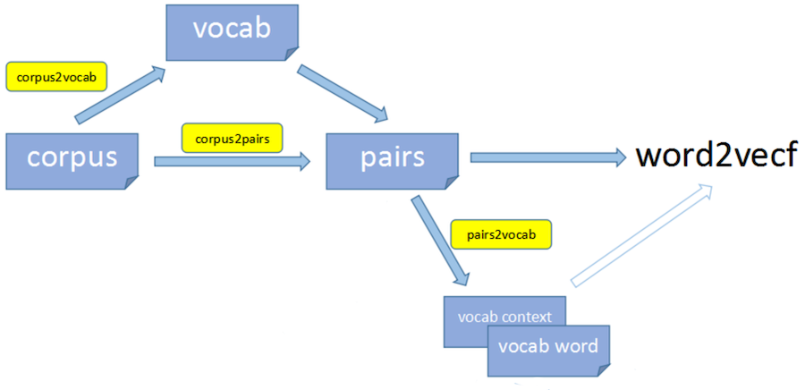

 

https://github.com/zhezhaoa/ngram2vec

https://aclanthology.org/D17-1023.pdf

ngram2vec toolkit could be used for learning text embedding. Text embeddings trained by ngram2vec are very competitive. They outperform many deep and complex neural networks and achieve state-of-the-art results on a range of datasets. 

[TODO]

* Cài đặt lại lấy input là `u16` token_id 
  (18k syllable_id, 14k oos_id và 32k word_id chọn lọc trong corpus)

  Không cần hash_table, nữa nên chỉ cần lưu 1 mảng 0..2^16-1

[>> DOING <<]

* Đọc hiểu thuật toán SGNS (skip-gram negative sampling)

  http://mccormickml.com/2016/04/19/word2vec-tutorial-the-skip-gram-model/
  
  Vẫn chưa hiểu thì mua e-book về mà đọc https://www.chrismccormick.ai/word2vec-ebook

[DONE]

* Tìm hiểu về `word2phrase`

  https://github.com/chrisjmccormick/word2vec_commented/blob/master/word2phrase.c

  Each run of the word2phrase tool looks at combinations of two words (or tokens), so the first pass would turn "New York" into "New_York" and the second pass would turn "New_York City" into "New_York_City".

* Gắp comments từ bản gốc sang `word2vec.c` để hiểu hơn về cách cài đặt thuật toán

  https://github.com/chrisjmccormick/word2vec_commented/blob/master/word2vec.c
